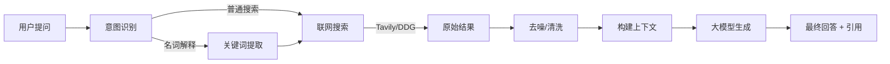

# 1. 技术选型与搜索引擎评估

基于LangChain框架，使用Tavily。

查询项目中所有调用api的地方，reasoner模式视场景使用

---

## 2. 系统架构方案 (RAG Integrated Search)

我们将构建一个基于 **Retrieve-Then-Generate** 的架构，确保回答的准确性和引用可追溯。

### 核心模块

1. **查询理解与优化 (Query Understanding)**
   * **Intent Analyzer**: 识别用户意图（如：`NOUN_EXPLAIN` vs `GENERAL_SEARCH` ）。
   * 若果有多项任务，列出任务单/流程列表，展示思维过程
   * 指代消解：理解代词的意思
   * **Query Expansion**: 将 "什么是程朱理学" 扩展为 "程朱理学 定义 代表人物 核心思想"。
2. **多源检索 (Multi-Source Retrieval)**
   * **Skill Dispatcher**: 动态选择搜索引擎（优先本地知识库，然后 Tavily）
3. **内容清洗与处理 (Content Processing)**
   * **Snippet Extraction**: 提取搜索结果摘要。
   * **Full Page Scraper** (可选): 对高相关度链接进行爬取 (使用 `AsyncHtmlLoader` + `BeautifulSoupTransformer`)。
   * **Text Splitter**: 切分长文本。
4. **增强生成 (Augmented Generation)**
   * **Context Construction**: 拼接 `[Source ID] Content` 格式的上下文。
   * **Citation Prompt**: 提示词要求 LLM 标注引用来源 (e.g., `[1]`)。

### 数据流图

---

## 3. API 密钥配置

### 3.1 Tavily Search (推荐)

* **注册**: 访问 [tavily.com](https://tavily.com/)
* **步骤**: 点击 "Get API Key" -> GitHub/Google 登录 -> 复制 Key (`tvly-...`)。
* **额度**: 免费版 1000次/月，无须绑卡。
* **配置**: `setx Tavily_API_KEY xxx`。

---

## 4 开发里程碑与验收标准

### Phase 1: 基础接入 (Completed)

* **目标**: 实现 无 Key 搜索，支持返回结构化数据 (Title, URL, Snippet)。
* **验收**:
  * [x] 调用 Skill 能返回 JSON 格式结果。
  * [x] 前端能展示来源列表。

### Phase 2: 高级搜索与RAG (Completed)

* **目标**: 集成 Tavily API，实现 "名词解释" 优化。
* **功能**:
  * [x] 自动识别名词解释意图，追加 "definition" 关键词。
  * [x] 使用 Tavily 的 `include_answer=True` 获取直接答案。
  * [x] 引入 `process` 字段展示搜索思维链。
* **验收**:
  * [x] 搜索 "程朱理学"，返回包含 "定义"、"代表人物" 的准确摘要。
  * [x] 响应时间 < 3秒。

### Phase 3: 深度内容抓取 (Completed)

* **目标**: 对搜索结果中的 URL 进行全文抓取与总结。
* **技术**: `aiohttp` + `BeautifulSoup` + `html2text`。
* **验收**:
  * [x] 当摘要过短 (< 150字符) 时，自动抓取 Top 1 网页内容。
  * [x] 将 HTML 转换为 Markdown 供 LLM 阅读。

### Phase 4 :针对名词解释与学科搜索的 Prompt 优化 (Completed)

* **目标**: 优化 RAG 生成的 Prompt，确保引用规范。
* **功能**:
  * [x] 新增 `web_search_zh` Prompt 模板。
  * [x] 规范引用格式 `[x]` 和名词解释结构 (定义-背景-核心-影响)。

---

